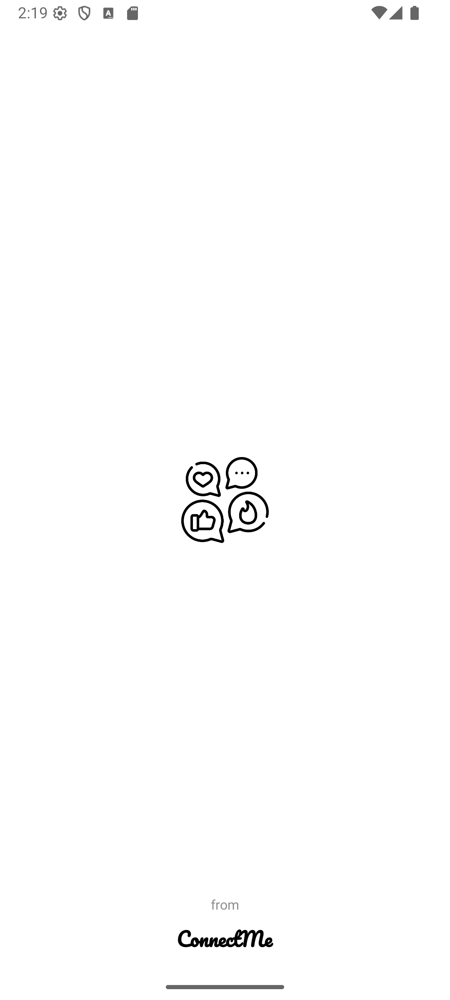
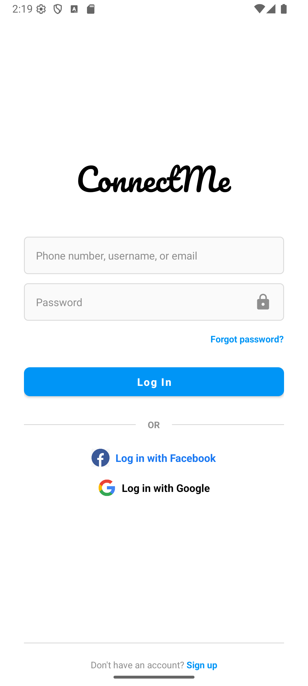
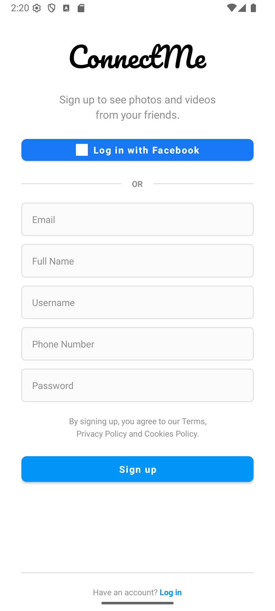
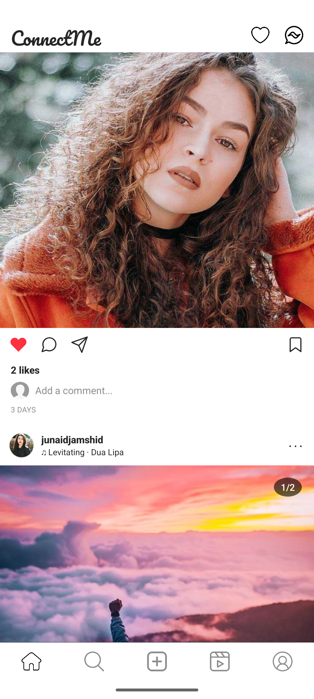
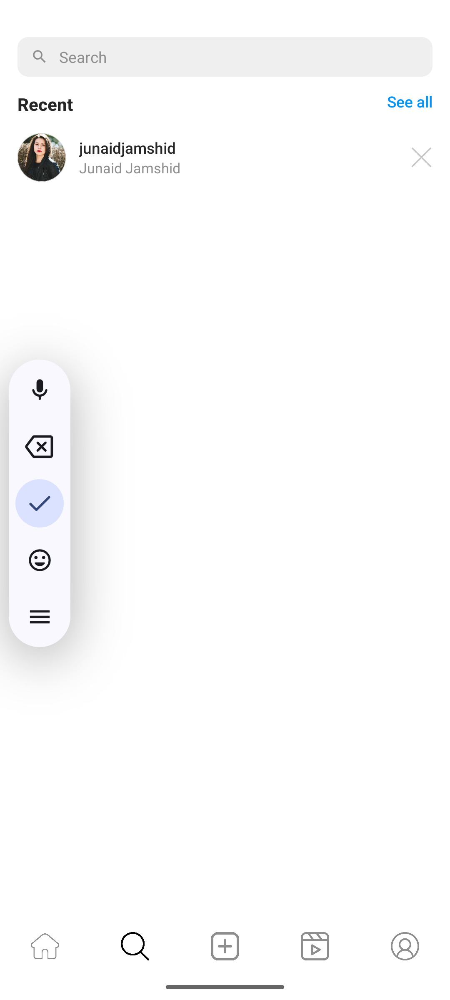
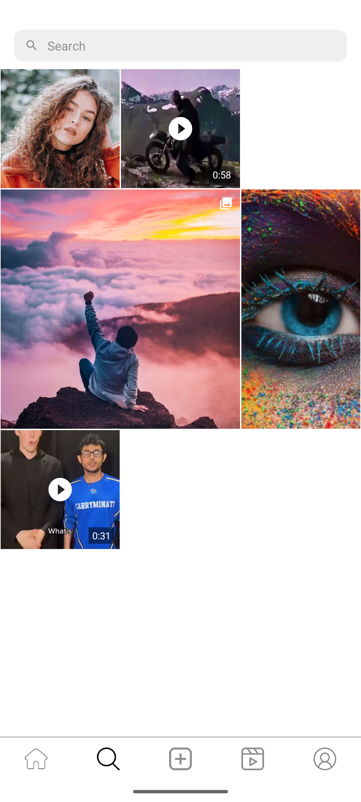
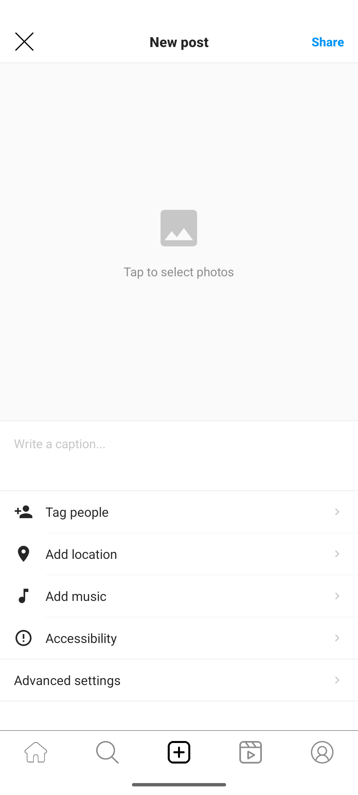
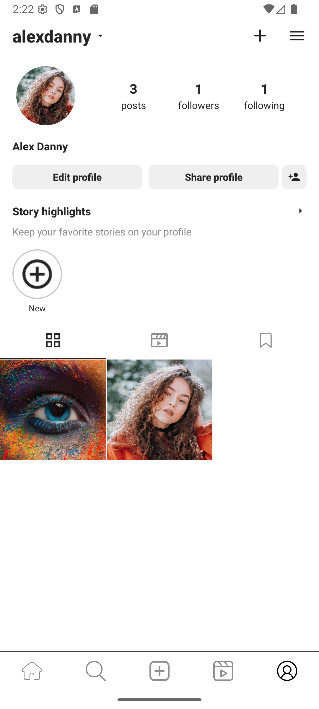
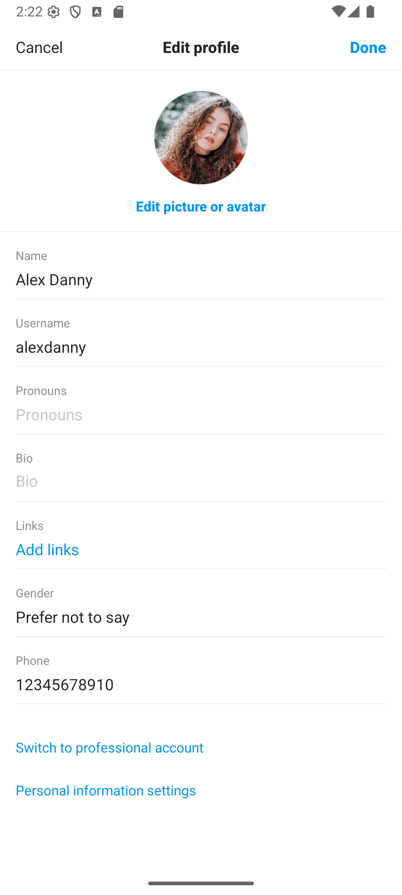

<p align="center">
  
</p>

<h1 align="center">🌐 ConnectMe</h1>

<p align="center">
  <strong>A Modern Social Networking App for Android</strong><br>
  Built with Kotlin, Supabase & Clean Architecture
</p>

<p align="center">
  <a href="#features">Features</a> •
  <a href="#screenshots">Screenshots</a> •
  <a href="#tech-stack">Tech Stack</a> •
  <a href="#architecture">Architecture</a> •
  <a href="#installation">Installation</a>
</p>

<p align="center">
  
  
  
  
</p>

---

## ✨ Overview

**ConnectMe** is a feature-rich social media application inspired by Instagram, designed to deliver a seamless social networking experience. Share moments through posts and stories, connect with friends via real-time messaging, discover new content through reels, and stay connected with video calls — all in one beautifully crafted app.

---

## 🎯 Features

### 📱 Core Features

| Feature | Description |
|---------|-------------|
| **🔐 Authentication** | Secure email/password login & registration via Supabase Auth |
| **📸 Posts & Feed** | Create stunning posts with images/videos, carousel support, location tagging & music |
| **📖 Stories** | Share 24-hour ephemeral content with view tracking |
| **🎬 Reels** | Discover short-form vertical videos with auto-play |
| **💬 Real-time Chat** | Instant messaging with text, images, read receipts & typing indicators |
| **📹 Video Calls** | Crystal-clear video/voice calls powered by Agora SDK |
| **👤 Rich Profiles** | Customizable profiles with bio, cover photos & post grids |
| **🔍 Discover** | Explore content and find new people to follow |

### 💫 Advanced Features

- ✅ **Real-time Updates** - Live feed sync via Supabase Realtime
- ✅ **Vanish Mode** - Disappearing messages for private conversations
- ✅ **Online Status** - See when friends are active
- ✅ **Video Compression** - Optimized media uploads
- ✅ **Shimmer Loading** - Beautiful loading states
- ✅ **Pull to Refresh** - Seamless content updates
- ✅ **Dark Mode Ready** - Modern UI design

---

## 📸 Screenshots

<table>
  <tr>
    <td align="center"><b>Splash</b></td>
    <td align="center"><b>Login</b></td>
    <td align="center"><b>Sign Up</b></td>
    <td align="center"><b>Home Feed</b></td>
  </tr>
  <tr>
    <td></td>
    <td></td>
    <td></td>
    <td></td>
  </tr>
  <tr>
    <td align="center"><b>Stories & Feed</b></td>
    <td align="center"><b>Search</b></td>
    <td align="center"><b>Explore</b></td>
    <td align="center"><b>Add Post</b></td>
  </tr>
  <tr>
    <td></td>
    <td></td>
    <td></td>
    <td></td>
  </tr>
  <tr>
    <td align="center"><b>Reels</b></td>
    <td align="center"><b>Profile</b></td>
    <td align="center"><b>Edit Profile</b></td>
    <td align="center"><b>Followers</b></td>
  </tr>
  <tr>
    <td></td>
    <td></td>
    <td></td>
    <td></td>
  </tr>
</table>

---

## 🛠️ Tech Stack

### Core Technologies

| Category | Technology |
|----------|------------|
| **Language** | Kotlin 2.1.0 |
| **Min SDK** | 24 (Android 7.0 Nougat) |
| **Target SDK** | 35 (Android 15) |
| **Build System** | Gradle 8.9.0 with KSP |
| **UI** | Android Views + ViewBinding |

### Backend & Database

| Service | Purpose |
|---------|---------|
| **Supabase Auth** | User authentication & session management |
| **Supabase PostgreSQL** | Relational database with RLS policies |
| **Supabase Storage** | Media file storage (images, videos) |
| **Supabase Realtime** | Live updates for messages, posts & presence |

### Key Libraries

```gradle
// 🏗️ Architecture
implementation 'com.google.dagger:hilt-android:2.53'         // Dependency Injection
implementation 'androidx.lifecycle:lifecycle-viewmodel-ktx'   // ViewModel
implementation 'org.jetbrains.kotlinx:kotlinx-coroutines'     // Async Operations

// 🔌 Backend (Supabase)
implementation platform('io.github.jan-tennert.supabase:bom:3.0.3')
implementation 'io.github.jan-tennert.supabase:postgrest-kt'
implementation 'io.github.jan-tennert.supabase:auth-kt'
implementation 'io.github.jan-tennert.supabase:storage-kt'
implementation 'io.github.jan-tennert.supabase:realtime-kt'

// 📹 Media
implementation 'androidx.media3:media3-exoplayer:1.2.1'       // Video Player
implementation 'com.github.AbedElazizShe:LightCompressor'     // Video Compression
implementation 'com.github.bumptech.glide:glide:4.15.1'       // Image Loading

// 📞 Video Calls
implementation 'io.agora.rtc:full-sdk:4.5.1'

// ✨ UI Enhancements
implementation 'com.facebook.shimmer:shimmer:0.5.0'           // Loading Effects
implementation 'com.airbnb.android:lottie:6.4.0'              // Animations
implementation 'de.hdodenhof:circleimageview:3.1.0'           // Circular Images
```

---

## 🏗️ Architecture

ConnectMe follows **Clean Architecture** principles with clear separation of concerns:

```
📁 app/
├── 📂 data/                    # Data Layer
│   ├── 📂 dto/                 # Data Transfer Objects
│   ├── 📂 mapper/              # DTO ↔ Domain Mappers
│   ├── 📂 remote/supabase/     # Supabase Data Sources
│   └── 📂 repository/          # Repository Implementations
│
├── 📂 domain/                  # Domain Layer (Business Logic)
│   ├── 📂 model/               # Domain Entities
│   ├── 📂 repository/          # Repository Interfaces
│   └── 📂 usecase/             # Use Cases
│       ├── 📂 auth/            # Login, SignUp, Logout
│       ├── 📂 post/            # CreatePost, GetFeed, Like
│       ├── 📂 story/           # CreateStory, GetStories
│       └── 📂 user/            # Profile, Follow, Search
│
├── 📂 presentation/            # Presentation Layer (MVVM)
│   ├── 📂 auth/                # Login, SignUp Screens
│   ├── 📂 call/                # Video Call UI
│   ├── 📂 chat/                # Messaging UI
│   ├── 📂 home/                # Feed & Stories
│   ├── 📂 post/                # Create Post, Comments
│   ├── 📂 profile/             # Profile Screens
│   ├── 📂 reels/               # Reels Player
│   └── 📂 search/              # Search & Explore
│
├── 📂 di/                      # Hilt DI Modules
└── 📂 util/                    # Utilities & Extensions
```

### Design Patterns

- **MVVM** - Model-View-ViewModel for presentation layer
- **Repository Pattern** - Abstraction over data sources
- **Use Cases** - Single responsibility business logic
- **Dependency Injection** - Hilt for loose coupling
- **StateFlow** - Reactive UI state management

---

## 💾 Database Schema

| Table | Description |
|-------|-------------|
| `users` | User profiles, settings & online status |
| `posts` | Posts with media, location & music |
| `post_images` | Carousel images for multi-image posts |
| `likes` | Post like relationships |
| `comments` | Post comments |
| `stories` | 24-hour ephemeral stories |
| `story_viewers` | Story view tracking |
| `followers` | Follow relationships |
| `conversations` | Chat conversation metadata |
| `messages` | Chat messages (text, image, voice) |
| `calls` | Call history |
| `active_calls` | Ongoing call sessions |

---

## 🚀 Installation

### Prerequisites

- Android Studio Hedgehog (2023.1.1) or newer
- JDK 17+
- Android SDK 35
- Supabase Account
- Agora Account (for video calls)

### Setup

1. **Clone the repository**
   ```bash
   git clone https://github.com/yourusername/ConnectMe.git
   cd ConnectMe
   ```

2. **Configure Supabase**
   
   Create `app/src/main/java/com/junaidjamshid/i211203/data/remote/supabase/SupabaseConfig.kt`:
   ```kotlin
   object SupabaseConfig {
       const val SUPABASE_URL = "your-supabase-url"
       const val SUPABASE_ANON_KEY = "your-supabase-anon-key"
   }
   ```

3. **Configure Agora (for video calls)**
   
   Add your Agora App ID to the appropriate configuration file.

4. **Run the database schema**
   
   Execute `supabase_schema.sql` in your Supabase SQL Editor.

5. **Build & Run**
   ```bash
   ./gradlew assembleDebug
   ```

---

## 📂 Project Structure

```
ConnectMe/
├── 📄 build.gradle              # Project-level build config
├── 📄 settings.gradle           # Project settings
├── 📄 supabase_schema.sql       # Database schema
├── 📁 app/
│   ├── 📄 build.gradle          # App-level dependencies
│   └── 📁 src/main/
│       ├── 📄 AndroidManifest.xml
│       ├── 📁 java/.../         # Kotlin source code
│       └── 📁 res/              # Resources (layouts, drawables)
└── 📁 connectME/                # Screenshots
```

---

## 🎨 UI/UX Highlights

- **Material Design 3** components
- **Smooth animations** with Lottie
- **Shimmer loading** placeholders
- **Pull-to-refresh** on all lists
- **Responsive layouts** for various screen sizes
- **Instagram-like** user experience

---

## 📄 License

This project is created for educational purposes.

---

## 👨‍💻 Author

**Junaid Jamshid**
- Student ID: i211203
- Course: Mobile Application Development

---

<p align="center">
  <b>⭐ If you found this project helpful, please give it a star! ⭐</b>
</p>

<p align="center">
  Made with ❤️ using Kotlin & Supabase
</p>
